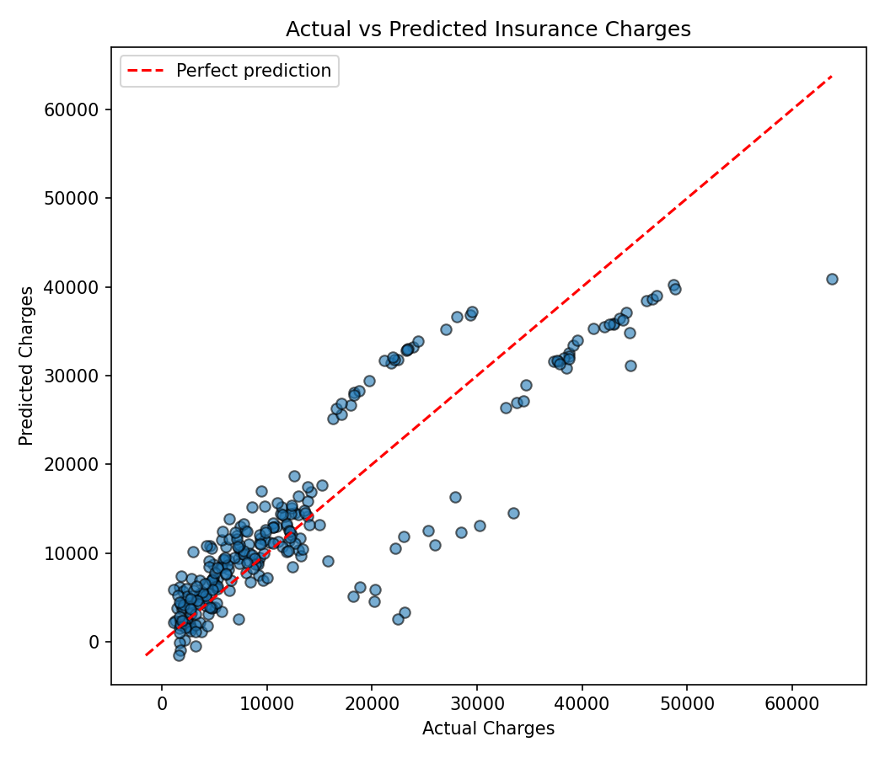

# Medical Insurance Cost Prediction using Multiple Linear Regression

**Author:** Arnav Tripathi 

**Registration Number:** 23BCE10756

**Application Number:** IN26011416

**Batch Number:** 2B

**Email ID:** arnav.23bce10756@vitbhopal.ac.in

## Objective

Build a Multiple Linear Regression model that predicts a customer's medical insurance charges from their personal and health-related information (age, sex, BMI, number of children, smoking status, and region).

## Dataset

The dataset (`insurance.csv`) used in this project is taken from here:
Medical Cost Personal Insurance Dataset (Kaggle):
https://www.kaggle.com/datasets/mirichoi0218/insurance

## Libraries Used

- pandas, numpy : data loading and manipulation
- scikit-learn : train/test split, Linear Regression, evaluation metrics
- matplotlib : actual vs predicted visualization

## Methodology

1. **Data Understanding**: Loaded the dataset (1338 rows, 7 columns), inspected the first five records, and identified features and target variable.
2. **Data Preprocessing**: Checked for missing values (none found). Encoded `sex` and `smoker` as binary (0/1) and one-hot encoded `region` (`drop_first=True`). Split the data 80/20 into train and test sets.
3. **Model Development**: Trained a Multiple Linear Regression model on the 6 features to predict `charges`.
4. **Model Evaluation**: Evaluated predictions using MAE, MSE, RMSE, and R², and plotted actual vs predicted charges.

## Results

| Metric | Value         |
| ------ | ------------- |
| MAE    | 4,181.19      |
| MSE    | 33,596,915.85 |
| RMSE   | 5,796.28      |
| R²    | 0.7836        |

**Observations**

1. `smoker` is the dominant driver of predicted charges, having the largest coefficient (+23,651).
2. The model explains about 78% of the variance in charges (R² = 0.78).
3. `sex` and `region` have small coefficients, contributing less to predictions than `age`, `bmi`, `children`, and `smoker`.

## Conclusion

The Multiple Linear Regression model predicts medical insurance charges with an R² of 0.78 and a Mean Absolute Error of $4,181.

**Key Findings:**

- The model explains 78% of the variance in insurance charges.
- The most significant factor affecting insurance charges is smoking status, which drastically increases the predicted charges.
- BMI, age, and number of children are also important, while sex and region have a negligible impact.

**Limitation of Linear Regression:**
A major limitation of Linear Regression for this problem is its inability to capture complex, non-linear interaction effects. For instance, the data indicates that the combination of smoking and high BMI increases charges much more than the sum of their individual effects. Because a basic linear model only assumes additive relationships, it struggles to accurately predict charges for high-BMI smokers, resulting in larger prediction errors for those specific individuals.
